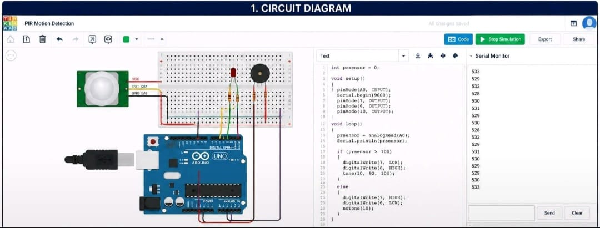
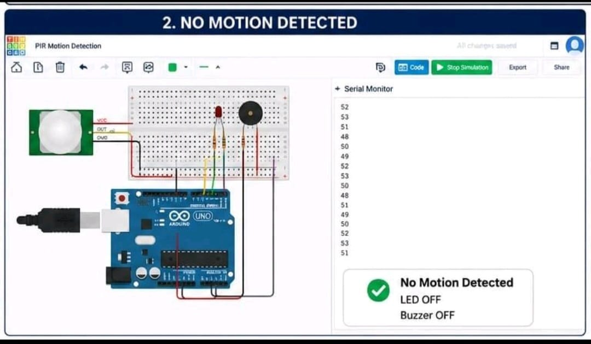
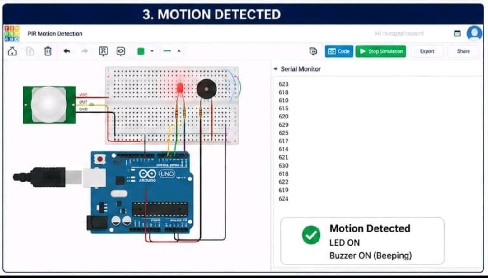

# PIR Motion Detection System Using Arduino UNO

## Internship Task 1

A PIR-based motion detection system developed using **Arduino UNO** and simulated using **Tinkercad Circuits**.

The system detects motion using a PIR (Passive Infrared) sensor. When motion is detected, the Arduino activates an LED and buzzer as an alert. When there is no motion, the alert remains inactive.

---

## Project Objective

The objective of this project is to design and simulate a basic motion detection and alert system using:

- Arduino UNO
- PIR Motion Sensor
- LED indicators
- Buzzer
- Resistors
- Breadboard
- Jumper Wires

---

## Components Used

- Arduino UNO
- PIR Motion Sensor
- Red LED
- Green LED
- Buzzer
- Resistors
- Breadboard
- Jumper Wires

---

## Working Principle

The PIR sensor detects infrared radiation changes caused by movement in its detection area.

The Arduino reads the sensor value through analog pin **A0**.

### When Motion is Detected

When the sensor value crosses the programmed threshold:

- Red LED is activated
- Green LED is turned OFF
- Buzzer is activated
- Motion status is displayed through the Serial Monitor

### When No Motion is Detected

When the sensor value is below the threshold:

- Green LED is activated
- Red LED is turned OFF
- Buzzer remains OFF
- The system remains in the normal monitoring state

---

## Pin Connections

| Component | Arduino Pin |
|---|---|
| PIR Sensor Output | A0 |
| Red LED | D7 |
| Green LED | D6 |
| Buzzer | D10 |

---

## Circuit Diagram

---

## Simulation Results

### 1. No Motion Detected

When no motion is detected, the system remains in the normal state.

### 2. Motion Detected

When motion is detected by the PIR sensor, the alert system is activated.

---

## Arduino Code

The Arduino program continuously reads the PIR sensor value and controls the LEDs and buzzer according to the detected motion.

The complete Arduino source code is available in:

**`PIR-Motion-Detection.ino`**

---

## Tools Used

- **Arduino IDE / Arduino C++**
- **Tinkercad Circuits**
- **GitHub**

---

## Applications

This type of motion detection system can be used as a basic concept for:

- Security systems
- Intrusion detection
- Smart lighting
- Home automation
- Motion-based alert systems

LinkedIn:  
https://www.linkedin.com/in/muskan-kumari-60b89236a/
